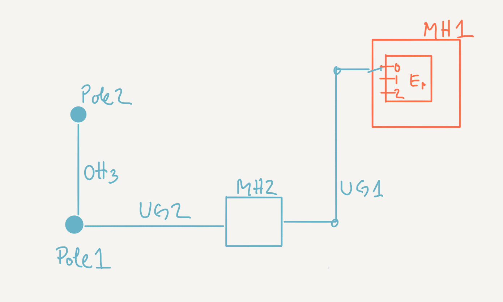

# Evaluate Oracle SpaceManager to model GIS Civil Network as a versioned geospatial database

## Logistics

1. Run Oracle12c as a docker container
  `docker run -d -p 8080:8080 -p 1521:1521 sath89/oracle-12c`
2. Check when it is up and running before use it as it takes some time to start
  `docker logs <containerId> -f`
3. Install sqlplus or run sqlplus within the container
   ```
   docker exec -it <containerId> /bin/bash
   sqlplus SYSTEM/oracle
   ```

## Attempt 1

### The data model

- There are no predefined table model. In other words, the application does not have any concept of entities (there is no ORM)
- We build table model on demand based on business needs.
- In a GIS database we have, at least, feature and feature classes tables.
- A feature table contains elements we place in a map. A feature table has at least per row, a geometry attribute with its shape and coordinates and a link to its feature class. e.g. if we have 3 manholes in a map, we have 3 rows on this table, one for each manhole.
- A feature class has one column for each attribute that describes the feature such as manufacturer or serialNumber. And each row defines a particular configuration of one feature class. e.g. In the example above, if all 3 manholes are of the same characteristics, we have 1 row in the Structure_Catalog table that describes that manhole and all 3 rows in the Structure table references this single row in the Structure_Catalog. This is a normalized database model. Later on we could decide to denormalize it, and duplicate the data in the feature table.
- We need to model Structures and Spans. We could model the two entities as just one. However structures and spans may have different attributes, thus we are going to treat them differently and have different tables for each one.
- For each type of feature we are going to create 3 tables: X, X_Catalog and X_Types. For example:
  - Structure table contains structure features
  - Structure_Catalog contains the feature classes for structure features
  - Structure_Types which allows us to classify/group the catalog of structures feature classes into sub-types/categories
- Feature tables are not related between each. Instead, we model that relationship thru a different table that models geometry networks, i.e. from node1 feature to node2 feature using a link feature.  
- We are going to model just one type of network, the civil one, hence we create a table that models just that. Later if we need another network, we create its own table.
- To model our civil network we are going to create a geometry table that has 2 nodes and 1 link column that points to a feature table respectively.
   - Node1 and Node2 columns refers to the STRUCTURE feature table
   - Link column refers to the SPAN feature table
   - CIVIL_NETWORK_ALLOW_RULES allows us to further define which specific types within a feature class can be connected

- We only need to version feature tables and the network table (not the rules). Static data like catalog, types and rules are global.

To install or view the data model, go to `model-01` and open/run `setup.sql`.


### Scenarios

We are going to define a number of scenarios that 2 users -Bob and Bill- will encounter while creating their plans. Each user works on his own work space.

NOTE:
- *feature* and *inventory* are synonyms.
- We are not leveraging the civil network geometry rules we defined in `setup.sql`.
- We are not keeping span geometry consistent when we move the nodes they are linked to. For example, says 2 poles are linked via an aerial span. If we change the coordinates of one of the poles, we are not going to adjust the coordinates of the span so that it still links the 2 poles. It is for now outside of the scope of these validation scenarios. The goal is just to validate the versioning scenarios.


0. We start with an inventory of structures and spans created by the `setup.sql` scripts and illustrated below:
  
1. [01-1-bobExtendsExistingPlan.sql](model-01/01-1-bobExtendsExistingPlan.sql) Bob creates a workspace where he extends the existing inventory. He does not modify any attributes but add new inventory elements. Bob posts his plan so that others can use it.
3. [01-2-bobModifiesItsOwnPlan.sql](model-01/01-2-bobModifiesItsOwnPlan.sql) Demonstrate Bob can remove previously added inventory and modify features and network attributes.
4. [01-3-billExtendsBobPlans.sql](model-01/01-3-billExtendsBobPlans.sql) Demonstrate Bill can work in parallel with Bob. Bill can use any inventory posted by Bob. But Bill cannot use any inventory that Bob has not posted yet. Bill will only add features and network connections. He will not modify attributes of existing features. This means that this scenario will not produce any conflict.
5. [01-4-bobFurtherExtendsPlansWithoutConflictWithBillChanges.sql](model-01/01-4-bobFurtherExtendsPlansWithoutConflictWithBillChanges.sql) Demonstrate that there are no conflicts when we simply add features. **I think this scenario is not necessary as we have already tested it**
6. [01-5-BobDetectsConflictOnAnInventory.sql](model-01/01-5-BobDetectsConflictOnAnInventory.sql) Demonstrate that we can detect conflicts on inventory (i.e. structure and span feature tables). Sequence of events:
  - Bill changes the location of MH2 and posts it
  - Bob changes the location of MH2 too
  - Bob detects that there is a conflict if he tried to post his changes
  - Bob resolves the change by keeping Bill changes instead of his.
